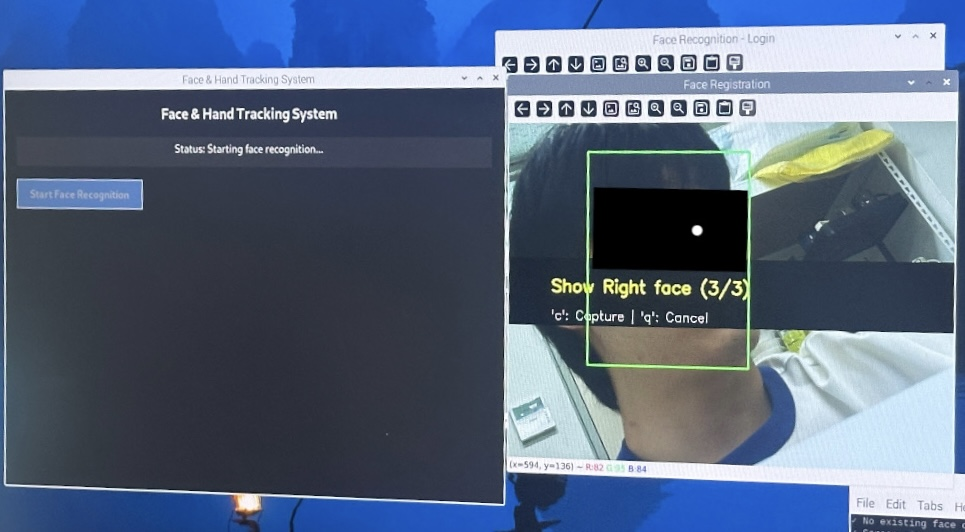
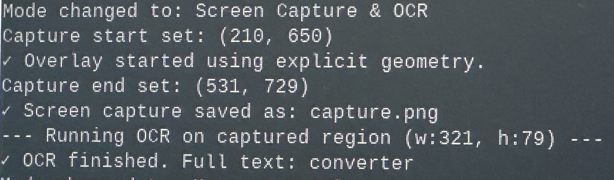

<h1 align="center">Vision-Based HCI System</h1>
<p align="center">
   Face Login, Hand Gesture Control, and OCR Capture System on Raspberry Pi 5
</p>
<p align="center">
    
    
</p>

<div align="center">
  <h3>🧑‍💻 Face Login</h3>
  
</div>

<div align="center">
  <h3>🖐️ Hand Gesture Capture</h3>
  
</div>

<div align="center">
  <h3>📄 OCR Result</h3>
  
</div>

## About The Project

이 프로젝트는 키보드나 마우스와 같은 전통적인 입력 장치 없이, 컴퓨터 비전 기술을 활용하여 사용자와 컴퓨터 간의 상호작용(HCI)을 구현하는 것을 목표로 합니다. 라즈베리파이 5와 카메라 모듈을 사용하여, 얼굴 인식을 통한 사용자 인증 및 손 제스처를 통한 마우스 제어, 화면 캡처, OCR 등의 복합적인 작업을 수행하는 통합 시스템입니다.

---

## 실행 방법

### 1. 사전 준비

- Raspberry Pi 5 + Camera Module 3
- Raspberry Pi OS (X11 환경 설정 필수)
  - `sudo raspi-config` > `Interface Options` > `Camera` → **Enable**
  - `sudo raspi-config` > `Advanced Options` > `Wayland` → **X11 설정**
  - `sudo reboot` 필수

### 2. 설치

#### 2.1 git clone
```
git clone https://github.com/summer-Gamba/fingerMouse.git
cd fingerMouse
```

#### 2.2 가상환경 설정 및 필수 패키지 설치
```bash
sudo apt update && sudo apt upgrade -y
sudo apt install python3-picamera2

python -m venv .venv --system-site-packages
source .venv/bin/activate

pip install -r requirements.txt 
```


#### 2.3 실행

```bash
python main.py
```

---

## Gesture Controls

| 제스처 / 키보드         | 기능 |
|-------------------------|-------------------------------------------|
| `Open` 🖐️                | 모드 전환 (마우스 제어 ↔ 캡처 & OCR)     |
| `Pointer` ☝️           | 커서 이동 또는 캡처 영역 지정             |
| `Pointer (1.5초 고정)` | 클릭 또는 영역 시작/끝 지정              |
| `Close` ✊              | 선택한 영역을 캡처하고 OCR 수행           |
| `r` 키                 | 캡처 리셋                                 |
| `q` 키                 | 시스템 종료                               |

---


## System Workflow

```bash
얼굴 인식 
    ├─ 등록 모드 (r 입력): 이름 등록 후 사용자 얼굴 3면 촬영
    └─ 로그인 모드: 1.5초간 얼굴 매치 성공 시 로그인 완료 
        ↓
손 제스처 인식
    ├─ Pointer ☝️ : 마우스 제어
    ├─ Open    🖐️ : 모드 전환
    └─ Close   ✊ : 캡처 실행
        ↓
화면 캡처 + OCR 수행
```

### Detailed Flow
1. **프로그램 시작**: Tkinter GUI 실행
2. **얼굴 인식**: `Start Face Recognition` 버튼 클릭 <br>
    2.1 **사용자 등록**: `r`키 입력 후 이름 등록 및 얼굴 3면 촬영 <br>
    2.2 **사용자 로그인**: 1.5초 인식 후 로그인 성공 → 로그인 완료 후 손 제스처 모드 진입
3. **손 제스처 모드** <br>
    3.1 **Pointer 제스처** ☝️: 마우스 이동 및 클릭 <br>
    3.2 **Open 제스처** 🖐: Capture 모드 전환 → Pointer 제스처 이용해 1.5초간 고정하면 캡쳐 START와 END 영역 지정 <br>
    3.3 **Close 제스처** ✊: 캡처 실행 & OCR 수행
7. **OCR 결과**: 터미널 출력 

---

## Key Features

| 기능 | 설명 |
|------|------|
| 얼굴 인식 로그인 | TFLite 기반 Lightweight-FD + MobileFaceNet 모델 사용, 지속 인식 기반 안정적인 로그인 제공 |
| 손 제스처 인식 | MediaPipe Hands + MLP 기반 제스처 분류기 활용 (Pointer, Open, Close 등) |
| 마우스 제어 | Pointer 제스처로 커서 이동, 손가락 고정 시 dwell-click 수행 |
| OCR 캡처 모드 | Open 제스처로 모드 전환 후 영역 지정 → Close 제스처로 캡처 실행 |
| OCR 텍스트 인식 | EAST로 텍스트 박스 검출, CRNN 기반 TFLite 모델로 문자 추출 |
| UI 시각화 | Tkinter 기반 전체 화면 오버레이 UI + 선택 영역 시각화 |

---


## Tech Stack

| 구분 | 사용 기술 |
|------|------------|
| 하드웨어 | Raspberry Pi 5, Camera Module 3 |
| GUI/입력 | Tkinter, pyautogui, pynput |
| 비전 처리 | OpenCV, Picamera2 |
| 얼굴 인식 | Lightweight-FD + MobileFaceNet (TFLite) |
| 제스처 인식 | MediaPipe Hands + Keypoint Classifier (TFLite) |
| OCR | EAST (DNN) + CRNN 기반 문자 인식기 (TFLite) |

---

## 프로젝트 구조

```bash
fingerMouse/
├── face/                              # 얼굴 인식 모델 
│   ├── Lightweight-Face-Detection.tflite
│   └── MobileFaceNet_9925_9680.tflite
├── handMini2/                         # 손 제스처 모델
│   ├── model/      
│   │   └── keypoint_classifier/
│   │       ├── keypoint_classifier.py
│   │       ├── keypoint_classifier_base.tflite
│   │       └── keypoint_classifier_label.csv
│   └── utils/    
│       └──calc_landmark.py
├── ocr/                               # OCR 모델 
│   ├── frozen_east_text_detection.pb
│   └── recognizer_model.tflite
├── main.py                            # 메인 실행 파일
├── requirement.txt
├── capture.png                        # 캡처된 이미지
└── README.md                          
```

---

## Acknowledgments

- [Qualcomm AI Hub](https://github.com/quic/ai-hub-models) for lightweight face detection model
- [Sirius AI](https://github.com/sirius-ai/MobileFaceNet_TF) for MobileFaceNet TensorFlow implementation
- ARM for Cortex-A76 architecture optimization
- [kinivi for hand gesture model based on MediaPipe](https://github.com/kinivi/hand-gesture-recognition-mediapipe)
- Raspberry Pi Foundation for Raspberry Pi 5 and Camera Module 3
- TensorFlow Lite team for optimized runtime

---

## Collaborators

<div align="center">

<table>
  <tr>
    <th>Face Recognition</th>
    <th>Hand Gesture</th>
    <th>OCR</th>
    <th>Hand Tracking</th>
  </tr>
  <tr>
    <td align="center">
      <a href="https://github.com/Bentlytrucker">
        <br>
        <sub><b>박지용</b></sub>
      </a>
    </td>
    <td align="center">
      <a href="https://github.com/mogld">
        <br>
        <sub><b>이진솔</b></sub>
      </a>
    </td> 
    <td align="center">
      <a href="https://github.com/Phaart1224">
        <br>
        <sub><b>조승현</b></sub>
      </a>
    </td>
    <td align="center">
      <a href="https://github.com/ijaemin">
        <br>
        <sub><b>이재민</b></sub>
      </a>
    </td>
  </tr>
</table>

</div>


